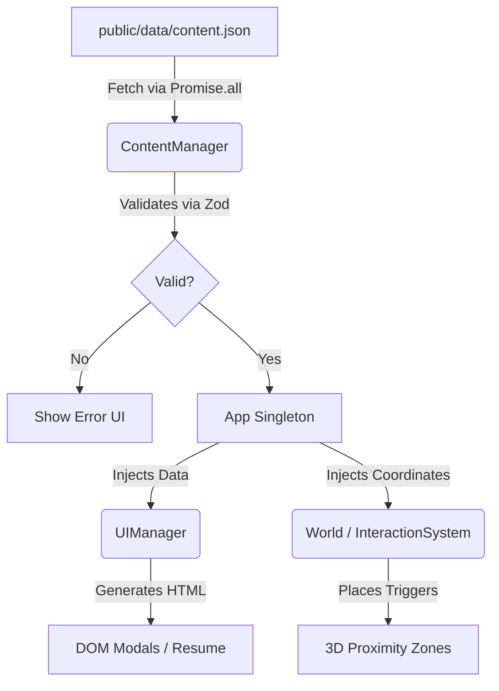
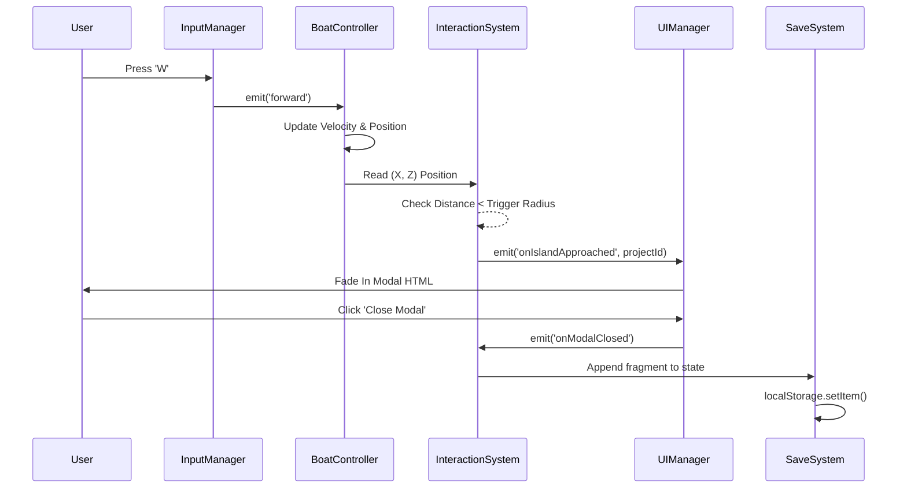
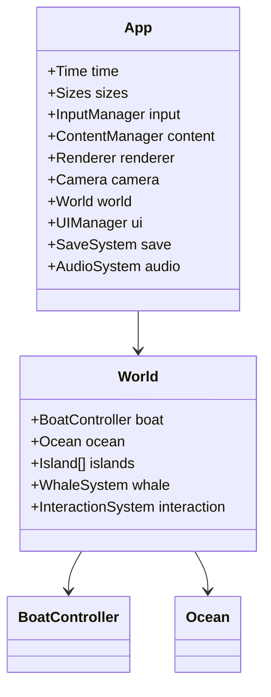

# Cosmic Ocean: Implementation Plan & Architectural Analysis

Provide a brief description of the problem, any background context, and what the change accomplishes.
This document analyzes the 11 provided production bibles for the "Cosmic Ocean" portfolio project and establishes the final project structure, architecture, and milestone-based execution plan.

## User Review Required

> [!IMPORTANT]
> The architectural analysis has identified a few minor contradictions in the provided documents which have been corrected in this plan:
> 1. **Asset Directory:** TAD stated `/src/assets/`. Corrected to `/public/assets/` to leverage Vite's static asset serving and match the Data Schema's references.
> 2. **Whale Trigger Z-Coordinate:** TAD stated `Z > 150`. World Layout stated `Z = 180`. Standardized to `Z = 180` to prevent triggering too early.
> 3. **Audio Initialization:** TAD triggers audio on "first user interaction". Roadmap triggers it explicitly on the `[Explore Experience]` button. Adopted the Roadmap approach for predictability.

## 1. Final Project Structure & 2. Complete Folder Hierarchy
We will use Vite + TypeScript + Three.js.

```text
├── public/
│   ├── data/
│   │   └── content.json          # Single Source of Truth
│   ├── assets/
│   │   ├── models/               # .glb files (Draco compressed)
│   │   ├── textures/             # .webp Matcaps & atlases
│   │   ├── audio/                # .mp3 files
│   │   ├── images/               # .webp thumbnails
│   │   └── icons/                # .svg icons
├── src/
│   ├── core/                     # Singletons & Engine
│   │   ├── App.ts                # Main Orchestrator
│   │   ├── Time.ts               # RAF loop & Delta Time
│   │   ├── Sizes.ts              # Viewport & Resize handler
│   │   ├── Camera.ts             # Orthographic Camera logic
│   │   ├── Renderer.ts           # WebGL + EffectComposer
│   │   ├── InputManager.ts       # Centralized event listener
│   │   ├── ContentManager.ts     # Parses content.json
│   │   └── UIManager.ts          # Resume mode & DOM control
│   ├── world/                    # 3D Entities
│   │   ├── World.ts              # Initializes entities
│   │   ├── BoatController.ts     # Kinematics & Mesh
│   │   ├── Ocean.ts              # Shader Plane
│   │   ├── Island.ts             # Generic class for regions
│   │   ├── WhaleSystem.ts        # Scripted GSAP event
│   │   ├── Collectibles.ts       # Starlight fragments
│   │   └── InteractionSystem.ts  # Proximity raycasting
│   ├── shaders/
│   │   ├── ocean/
│   │   │   ├── vertex.glsl
│   │   │   └── fragment.glsl
│   │   └── postprocessing/
│   │       └── blur.glsl
│   ├── ui/                       # DOM Logic
│   │   ├── index.html            # Main markup template
│   │   └── components/           # Vanilla JS/HTML generators
│   ├── utils/
│   │   ├── EventEmitter.ts
│   │   ├── mathUtils.ts
│   │   └── Store.ts              # LocalStorage Save System
│   ├── styles/
│   │   ├── main.css              # Variables & Resets
│   │   └── components.css        # Modal & Resume CSS
│   ├── main.ts                   # Entry point
│   └── vite-env.d.ts
├── package.json
├── tsconfig.json
└── vite.config.ts
```

## 3. Dependency List & 4. NPM Package List
**Dependencies:**
- `three`: Core WebGL rendering engine.
- `gsap`: Scripted animations (Whale, Lighthouses, Modals).
- `howler`: Audio management.
- `zod`: Strict JSON schema validation for `content.json`.

**Dev Dependencies:**
- `vite`, `typescript`
- `@types/three`, `@types/howler`
- `gltf-pipeline`: For local Draco compression processing.

## 5. Environment Variables List
Because this is a static portfolio leveraging JSON, traditional API keys are omitted.
- `VITE_PUBLIC_URL`: Base URL for resolving assets robustly across Vercel/Netlify.
- `VITE_ANALYTICS_ID`: ID for analytics (e.g., PostHog/Google Analytics).

## 6. Asset Pipeline
1.  **Blender Generation:** Models are low-poly. No high-res sculpts.
2.  **Naming Convention:** Mesh names use regex prefixes (`_col_`, `_vis_`, `_water_`) for runtime logic assignment.
3.  **Export & Compression:** Export to `.glb`, run through `gltf-pipeline -d` for Draco compression.
4.  **Placement:** All files sit in `/public/assets/models/`.
5.  **Loading:** The custom `AssetManifest` determines priority. `Promise.all` loads Priority 0 (Hub, Boat) to unblock TTI immediately.

## 7. Data Flow Diagram


## 8. Event Flow Diagram


## 9. Class Diagram


## 10. State Management Architecture
A Vanilla JS `SaveSystem` class that handles simple object state persistence.
- **State Object:** Tracks `fragmentsCollected`, `observatoryFound`, `lighthouseIgnited`.
- **Persistence:** Serializes to `localStorage` key `cosmicOceanSave`.
- **Reactivity:** Emits events (`EventEmitter`) when values change so the UI fragment counter can update independently.

## 11. Feature Flag Architecture
Driven entirely by `content.json` -> `featureFlags`.
- Available Flags: `enableWhale`, `enableAudio`, `enableAnalytics`, `enableObservatory`, `enablePostProcessing`.
- `App.ts` skips initializing sub-systems if their respective flags are false.
- Dynamic Kill Switch: `Time.ts` monitors FPS. If FPS < 45 consistently, `enablePostProcessing` is forced `false` at runtime.

## 12. Save System Architecture
- Syncs the `SaveGameState` schema to `localStorage`.
- Only commits writes upon major milestones to prevent frame-drops (e.g., closing a modal, finding the observatory).
- Wraps `localStorage` calls in `try/catch` to gracefully fall back to a RAM-only state in strict Incognito browsers.

## 13. Build Order
The following Build Order serves as the chronological path for executing the coding milestones.

---

## Proposed Changes (Coding Milestones)

The development will strictly adhere to these chronological milestones to guarantee the project remains shippable at all times.

### Milestone 1: Engine Foundation
- **Goal:** Set up Vite + TypeScript scaffold and the core singleton architecture.
- **Action:** Create `App`, `Time`, `Sizes`, `Camera`, `Renderer` (Orthographic without post-processing yet). Render a blank scene to verify WebGL context.

### Milestone 2: Data & UI Architecture (Vertical Slice Core)
- **Goal:** Allow the application to act as a 2D resume immediately.
- **Action:** Create `ContentManager` to load and parse `/public/data/content.json`. Build `UIManager` to inject this data into the DOM (Landing Screen, Standard Resume). Implement the 3D pause/resume toggle.

### Milestone 3: The Kinematic Boat
- **Goal:** Achieve tactile Game Feel.
- **Action:** Implement `InputManager`. Build `BoatController` utilizing pure math (Velocity, Acceleration, Drag) without Rapier.js. Implement smooth `MathUtils.lerp` for the Camera follow logic.

### Milestone 4: Islands & Proximity System
- **Goal:** Link the 3D space to the 2D UI.
- **Action:** Create `InteractionSystem`. Calculate fast 2D (X, Z) distance between the boat and JSON-provided island coordinates. Trigger DOM Modals when in radius.

### Milestone 5: Asset Pipeline & Ocean Shader
- **Goal:** Apply the visual identity.
- **Action:** Integrate `GLTFLoader` + Draco. Load `.glb` islands. Replace the flat floor with a custom subdivided `ShaderMaterial` (Gerstner waves + Depth Coloring).

### Milestone 6: Gameplay Loops & State
- **Goal:** Add the "Quest" mechanics.
- **Action:** Implement `Collectibles` (Starlight Fragments snapping to boat). Build `SaveSystem` to track progress. Implement Lighthouse ignition sequence.

### Milestone 7: Cinematics & Polish
- **Goal:** Add the final "WOW" factor.
- **Action:** Build the `WhaleSystem` (GSAP). Integrate `Howler` for spatial/ambient audio. Implement the `1.0 - sin(vUv.y * M_PI)` tilt-shift Blur pass in the `EffectComposer`.

### Milestone 8: QA & Performance Lock
- **Goal:** Guarantee mobile performance.
- **Action:** Freeze static matrices. Verify draw calls < 80. Implement the FPS Kill Switch. Validate accessibility (Tab navigation, Contrast).

---

## Verification Plan

### Automated Tests
- Zod schema validation will guarantee that `content.json` cannot crash the application at runtime.

### Manual Verification
- Execute the **Lighthouse Recruiter Journey Test** (ST-01 -> ST-10). The full flow must complete in < 3 minutes without performance hiccups on Desktop Chrome and iOS Safari.
- Profile using Chrome DevTools to ensure Main Thread time stays < 16ms and memory usage does not leak.
